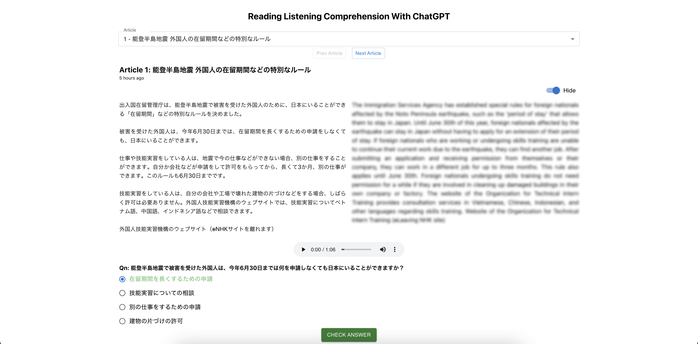
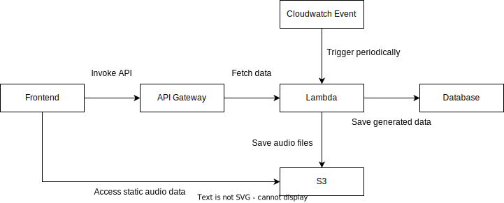

# RoboTeacher: Learning Reading And Listening Comprehension With ChatGPT
This app targets language learners to practice reading and listening comprehension using online articles. Online articles are scraped daily. Questions, translations and voice-overs are generated from the passage with ChatGPT. Learn at [RoboTeacher](https://roboteacher.netlify.app/)

<p align="center" width="100%">
  
</p>

## Architecture
<p align="center" width="100%">
  
</p>

The application runs on a serverless architecture on AWS. Lambda is triggered daily using Cloudwatch Events to scrap online articles. The article is sent to OpenAI to generate questions, translated text, and voice-overs. The audio is saved on S3 and can be publicly accessed. The generated data is saved in MongoDB. The lambda is exposed via API Gateway as a RESTful API to allow the frontend to invoke the API and fetch data. The infrastructure is configured with Terraform.

## Setup
### Setup Database
- Create a free [MongoDB](https://www.mongodb.com/cloud/atlas/lp/try4) database

### Setup AWS infrasturcture
- Setup [Terraform Cloud](https://app.terraform.io/) to provision resources on AWS
- Initialise and apply changes in the `deployment` folder
```
terraform init
terraform apply
```

### Backend
- Install python 3.8
- Create and update the environment variables in `.env` in the `backend` folder
```
pip install -r requirements.txt
python3 lambda_function.py
```
- Build docker image and push to AWS Lambda
```
bash build.sh
```

### Frontend
- Install node v18 and yarn v1.22
- Create and update the environment variables in `.env` in the `frontend` folder
```
yarn install
yarn start
```

### Experiments
- Experiments are conducted in the `exp` folder

## Reference
- https://www3.nhk.or.jp/news/easy/